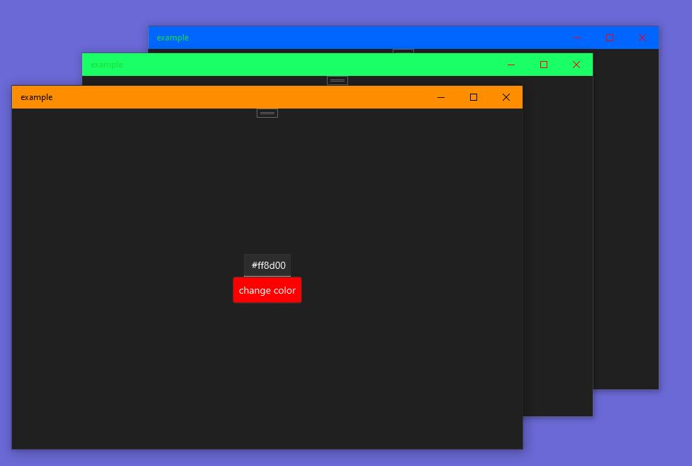

# React Native Custom Window

<p align="center">
  
     
</p>

<p align="center">

</p>
This is a native module for React Native that provides access to certain window-related functionalities and file picking capabilities. The module is designed to work with both Android and iOS platforms.

## Installation

To use this module in your React Native project, follow these steps:

1. Install the npm package using the following command:

```bash
npm install react-native-custom-window --save
```

2. Link the native module to your project:

```bash
react-native link react-native-custom-window
```

## Usage

### TitleBar Module

#### Import

```javascript
import { FilePicker } from 'react-native-custom-window';
```
#### Methods

```typescript
  interface TitleBarColorProps {
    backgroundColor: string;
    inactiveBackgroundColor?: string;
    buttonBackgroundColor?: string;
    buttonInactiveBackgroundColor?: string;
    buttonForegroundColor?: string;
    buttonHoverForegroundColor?: string;
    buttonPressedForegroundColor?: string;
    buttonInactiveForegroundColor?: string;
    foregroundColor?: string;
    inactiveForegroundColor?: string;
    buttonHoverBackgroundColor?: string;
    buttonPressedBackgroundColor?: string;
  }
```

- **enableExtend(): Promise<void>**
  Enables the extension of the window, allowing it to go titleBar.

- **TitlebarColor(props: TitleBarColorProps): Promise<void>**
  Sets the title bar color with the provided background and button background colors. The `backgroundInactive` and `buttonBackgroundInactive` are used when the window is inactive.

- **addBackButton(): Promise<void>**
  Adds a custom back button to the window.

- **removeBackButton(): Promise<void>**
  Removes the custom back button from the window.

- **disableBackButton(): Promise<void>**
  Disables the functionality of the default back button.

- **disableExtend(): Promise<void>**
  Disables the window extension, preventing it from going fullscreen.

### FilePicker Module

#### Import

```javascript
import { FilePicker } from 'react-native-window-file-picker-module';
```

### Window Module

#### Import

```javascript
import { titleBar } from 'react-native-custom-window';
```

#### Methods

```typescript
  type ISetSize = {
    width: number;
    height: number;
  }
```

- **setSize(props: ISetSize): void**
  Sets a custom size for the window.

- **isFullScreen(): Promise<void>**
  Checks if the window is in fullscreen mode.

- **enterFullscreen(): Promise<void>**
  Activates the fullscreen mode for the window.

- **leaveFullscreen(): Promise<void>**
  Deactivates the fullscreen mode for the window.

### FilePicker Module

#### Import

```javascript
import { FilePicker } from 'react-native-window-file-picker-module';
```


#### Method

- **pickFile(): Promise<string>**
  Opens a file picker dialog, allowing the user to select a file. Returns a promise that resolves to the selected file's path.

## Example

```javascript
import React from 'react';
import { View, Button } from 'react-native';
import { fullscreen, FilePicker } from 'react-native-window-file-picker-module';

const App = () => {
  const handlePickFile = async () => {
    try {
      const filePath = await FilePicker.pickFile();
      console.log('Selected file path:', filePath);
    } catch (error) {
      console.error('Error while picking a file:', error);
    }
  };

  return (
    <View>
      <Button title="Go Fullscreen" onPress={() => fullscreen.enableExtend()} />
      <Button
        title="Pick a File"
        onPress={handlePickFile}
      />
    </View>
  );
};

export default App;
```

## Platform Support

- Android
- iOS
- Windows

Note: Please ensure you have the necessary permissions and configurations for file picking functionality on both platforms.

## Contribution

This module is open for contributions. Feel free to create issues, pull requests, or suggest improvements.

## License

This project is licensed under the [MIT License](https://opensource.org/licenses/MIT).
